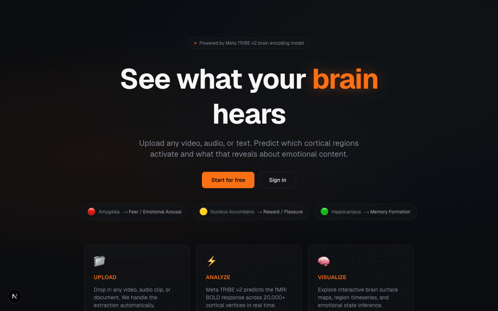

<div align="center">


<a href="https://git.io/typing-svg">
  
</a>

<p>
  
  <a href="https://www.linkedin.com/in/mahanyasbaira"></a>
  <a href="https://mahanyas.vercel.app/"></a>
  <a href="mailto:mahanyasbaira16@gmail.com"></a>
</p>

</div>

---

## 🧠 Recent Project

<div align="center">

# 🧠 NeuroSync  
### Multimodal Brain Encoding — TRIBE v2 Inspired

[](https://neurosync-tribe-v2.vercel.app)

<br/>



</div>

---

## 👋 About Me

```yaml
name: Mahanyas Baira
role: Software Engineer • ML Researcher • Systems Engineer
location: Fort Collins, Colorado

currently:
  - ML Research Assistant — +20% classification accuracy on 11,000+ messages
  - Cybersecurity Intern — automated triage of 200+ risks
  - Systems Engineer — automation across 600+ endpoints
  - CS Peer Mentor — Python + DSA
